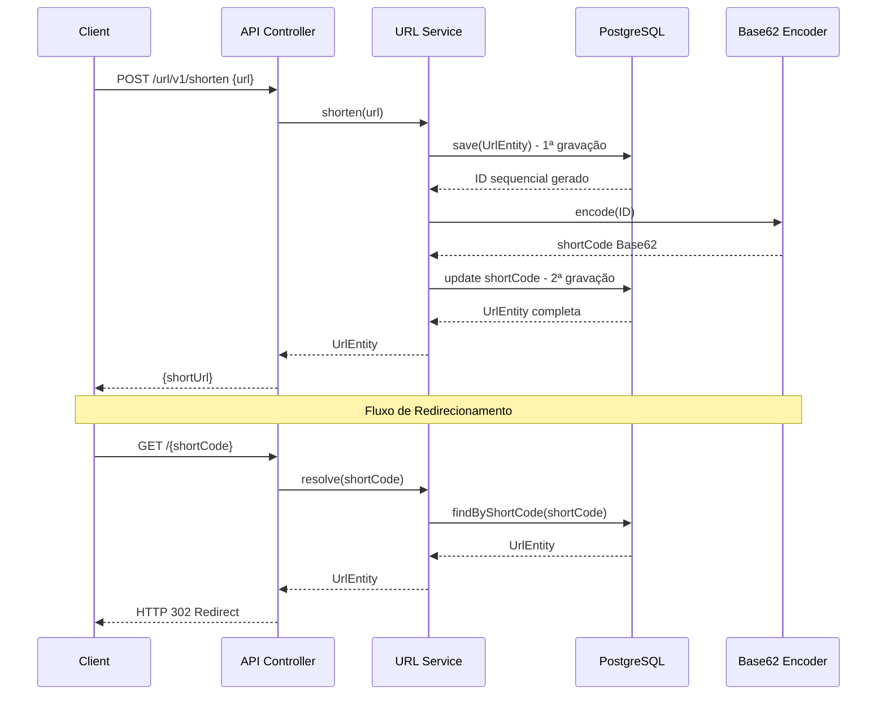

# BlinkLink 🔗

**API de Encurtamento de URLs: Simples, Eficiente e Containerizada.**

[](https://openjdk.org/)
[](https://spring.io/projects/spring-boot)
[](https://www.docker.com/)
[](https://www.postgresql.org/)
[](https://swagger.io/)

---

## 📖 Sobre o Projeto

BlinkLink é uma **API REST** desenvolvida para resolver o problema de URLs longas com foco em **performance** e **integridade de dados**. A aplicação utiliza uma estratégia matemática de geração de IDs únicos (Base62) para evitar colisões e garantir escalabilidade.

**Projeto open-source focado em boas práticas de desenvolvimento backend.**

---

## 🛠 Tech Stack (v1.0.0)

- **Java 21 (LTS)** & **Spring Boot 4.0**
- **PostgreSQL 17** (Persistência Relacional)
- **Flyway** (Migração de Dados)
- **Docker & Docker Compose** (Ambiente Reprodutível)
- **SpringDoc OpenAPI** (Swagger UI)

---

## 🧠 Arquitetura & Decisões de Design

### Estratégia de ID: Two-Step Save

O BlinkLink utiliza uma estratégia de **persistência em duas etapas** para gerar códigos curtos únicos:

1. **Primeira Gravação:** A URL original é salva no banco de dados, gerando um ID sequencial único.
2. **Conversão Base62:** O ID numérico é convertido para Base62 (0-9, a-z, A-Z), criando um código curto legível e URL-safe.
3. **Segunda Gravação:** O código curto é atualizado na mesma transação.

**Por que Base62?** Garantimos **unicidade matemática** e **performance** ao evitar colisões de hash. Cada ID sequencial resulta em um código único e compacto.

### Segregação de Responsabilidades

A API separa claramente dois fluxos distintos:

- **API de Criação:** `POST /url/v1/shorten` - Endpoint versionado para criação de links encurtados.
- **Rota de Acesso:** `GET /{shortCode}` - Rota na raiz para redirecionamento rápido (HTTP 302).

Essa separação permite URLs mais curtas para usuários finais e clareza na arquitetura da API.

---

## 📊 Fluxo



---

## 🚀 Como Rodar (Quick Start)

1. **Clone o repositório:**
   ```bash
   git clone https://github.com/PabloTzeliks/blink-link.git
   cd blink-link
   ```

2. **Suba os containers:**
   ```bash
   docker-compose up -d
   ```

3. **Acesse a documentação Swagger:**
   ```
   http://localhost:8080/swagger-ui.html
   ```

---

## 🔮 Roadmap v2.0.0 (Próximos Passos)

**Foco na robustez técnica e preparação para escala.**

- [ ] **Refatoração Arquitetural:** Evolução dos DTOs existentes (por exemplo, `UrlRequest` e `UrlResponse`) e maior desacoplamento entre API e Banco de Dados.
- [ ] **Tratamento de Erros Profissional:** GlobalExceptionHandler seguindo a RFC 7807 (Problem Details).
- [ ] **Testes Automatizados:** Implementação de testes unitários (JUnit + Mockito) e de integração para garantir a estabilidade.
- [ ] **Feature: Expiração de Links (TTL):** Implementação de jobs agendados para desativar/limpar links antigos automaticamente.
- [ ] **CI/CD Básico:** Pipeline no GitHub Actions para build e testes automáticos a cada Push.

*Nota:* O foco será na engenharia de software, mantendo a infraestrutura on-premise (sem Cloud/Cache por enquanto).

---

## 📞 Contato & Autor

<div align="center">

**Pablo Ruan Tzeliks**

[](https://www.linkedin.com/in/pablo-ruan-tzeliks/)
[](https://github.com/PabloTzeliks)
[](mailto:arq.pabloo@gmail.com)

*Desenvolvedor Backend | Java & Spring Boot Enthusiast*

</div>

---

<div align="center">

**⭐ Se este projeto foi útil, considere dar uma estrela!**

*Construído com ☕ e dedicação*

</div>
