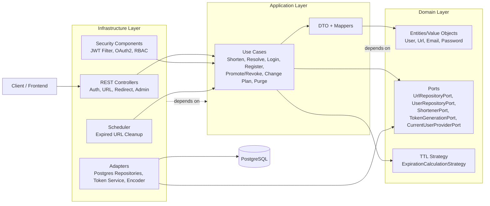
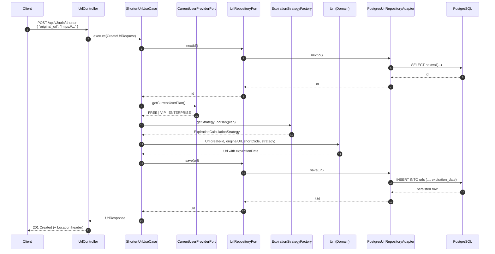
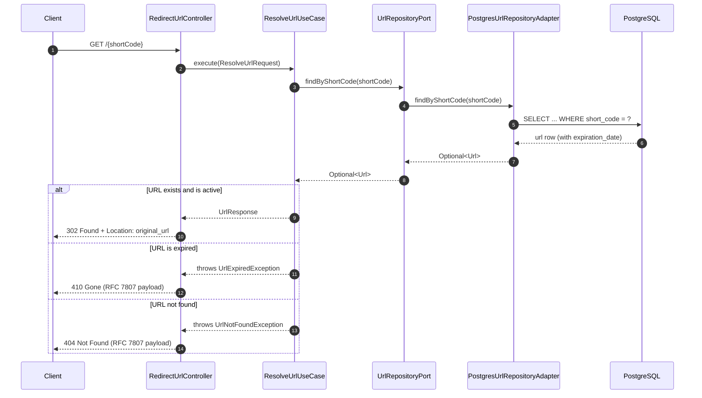

# BlinkLink 🔗

**BlinkLink** is a production-ready URL Shortener REST API built with **Java 21**, **Spring Boot 4**, and **PostgreSQL**, designed with **Clean Architecture**, **Hexagonal Architecture (Ports & Adapters)**, and pure **DDD**.

[](https://openjdk.org/)
[](https://spring.io/projects/spring-boot)
[](https://www.postgresql.org/)
[](https://www.docker.com/)
[](https://github.com/features/actions)
[](https://flywaydb.org/)
[](https://junit.org/junit5/)
[](https://www.jacoco.org/jacoco/)
[](https://github.com/PabloTzeliks/blink-link)

---

## Executive Summary — The v3.0.0 Leap

BlinkLink started as an MVP and evolved into a secure, scalable API platform. In **v3.0.0**, the project introduces:

- A full **IAM layer** with role- and plan-aware domain rules.
- **Stateless JWT authentication** delivered via **HttpOnly cookie** (`jwt_token`).
- **OAuth2 login** with **Google** and **GitHub** providers.
- URL lifecycle management with plan-based TTL (**FREE**, **VIP**, **ENTERPRISE**).
- Asynchronous garbage collection for expired links with PostgreSQL-safe concurrency.

This release keeps the Domain pure and framework-agnostic while pushing operational maturity for production environments.

---

## Architecture & Design

### 1) Structural View — Clean + Hexagonal Architecture



### 2) Sequence View — URL Creation with TTL Calculation (v3.0.0)



### 3) Sequence View — Redirect Resolution + Expiration Behavior



> The database is accessed only through adapters/ports; the **Domain never depends on JPA or SQL**.

---

## Architectural Decision Records (ADRs) & Trade-offs

### ADR-001 — JPA Impedance Mismatch and Optimistic Locking (`@Version`)

**Context:** In pure DDD, `User` IDs are generated in the domain. With pre-filled IDs, Spring Data JPA can treat persistence as update-oriented behavior and may trigger extra reads.

**Decision:** Keep Domain entities persistence-agnostic and place `@Version` only in `UserEntity` (Infrastructure).

**Why:** This keeps the Domain pure while enabling JPA-friendly lifecycle management and optimistic concurrency control.

**Trade-off:**
- **Gain:** Domain purity + safer concurrent updates.
- **Cost:** More complexity in gateway mapping/update paths, because infrastructure must handle persistence metadata/version lifecycle explicitly.

### ADR-002 — URL Lifecycle + Asynchronous Garbage Collection

**Context:** URL expiration is plan-driven (7 days, 1 year, 10 years). Expired links must be deleted without causing contention or blocking.

**Decision:**
- Use **Strategy Pattern** (`ExpirationCalculationStrategy`) to compute TTL at creation.
- Use `PurgeUrlsUseCase` + scheduler for background deletion.
- Use PostgreSQL native batch deletion with **`FOR UPDATE SKIP LOCKED`**.

**Why:**
- TTL rules stay isolated and testable.
- Cleanup runs in chunks, minimizing lock pressure.
- Multiple app instances can safely purge in parallel while avoiding **table-level lock contention**.
- User plan policy and garbage collection are connected by design: plan-driven TTL is computed at creation time and persisted as `expiration_date`; purge jobs remove only rows whose expiration has elapsed.

**Trade-off:**
- **Gain:** High resilience and horizontal cleanup safety.
- **Cost:** Operational complexity (scheduler tuning: cron, batch size, sleep interval).

---

## v2.0.0 vs v3.0.0 — Feature Evolution

| Area | v3.0.0 |
|---|---|---|
| Security Model | **IAM layer** with role + plan domain modeling |
| Authentication | **Stateless JWT** in **HttpOnly cookie** (`jwt_token`) |
| Social Login | **OAuth2** with Google and GitHub |
| Authorization | **RBAC** with ADMIN-protected management endpoints |
| URL Lifecycle | Plan-based TTL: **FREE (7d)**, **VIP (1y)**, **ENTERPRISE (10y)** |
| Expiration Handling | **410 Gone** + async purge engine with `FOR UPDATE SKIP LOCKED` |
| Domain Model | Stronger **DDD** boundaries, ports, use cases, domain strategies |
| Testing & Quality Gate | **89 tests** and **JaCoCo 80% instruction threshold** in pipeline |

---

## DDD in Practice (Strongly Enforced in v3.0.0)

- **Domain as source of truth:** `User`, `Url`, `Role`, `Plan`, `Email`, `Password`, and domain exceptions encode business language and invariants.
- **Application orchestration only:** use cases (`ShortenUrlUseCase`, `ResolveUrlUseCase`, `PurgeUrlsUseCase`, auth/admin use cases) coordinate behavior through ports instead of frameworks.
- **Ports & adapters discipline:** persistence, JWT, OAuth2, and web concerns stay in Infrastructure; the Domain remains framework-agnostic.
- **Open/Closed domain policies:** expiration logic uses `ExpirationCalculationStrategy` + factory keyed by user plan, avoiding conditional sprawl in use cases.

---

## Key Features

- **RBAC** with `USER` and `ADMIN`, enforced through method-level authorization.
- **Stateless auth** with JWT in **HttpOnly cookie** and custom security filter.
- **OAuth2 login** with Google and GitHub.
- Plan-aware URL lifecycle policies (**FREE / VIP / ENTERPRISE** TTL).
- RFC 7807-style **Problem Details** for consistent API error responses.
- Batch purge engine for expired URLs using PostgreSQL row-level locking semantics.
- Test strategy covering **Unit**, **Integration** (Testcontainers + PostgreSQL), and **E2E**.
- CI/CD pipeline with Maven verification, JaCoCo coverage checks, Docker image build, and compose validation.

---

## Quality Gates: Tests & Coverage

- **89 automated tests** across Unit, Integration, and E2E layers.
- **JaCoCo minimum coverage gate: 80% instruction coverage** (build fails if threshold is not met).
- Test execution is part of CI through `mvn verify -B`, with JUnit reporting and JaCoCo artifacts published in GitHub Actions.

---

## Tech Stack

| Layer | Technology |
|---|---|
| Language | Java 21 |
| Framework | Spring Boot 4.0.1 |
| Data | Spring Data JPA + PostgreSQL 17 |
| Migrations | Flyway |
| Security | Spring Security, OAuth2 Client, JWT (`java-jwt`), BCrypt |
| API Docs | SpringDoc OpenAPI (Swagger UI) |
| Testing | JUnit 5, Spring Test, Mockito, Testcontainers |
| Build | Maven |
| Containers | Docker, Docker Compose |
| CI/CD | GitHub Actions |

---

## API Reference (Shortened)

### Create short URL

```bash
curl -i -X POST 'http://localhost:8080/api/v3/urls/shorten' \
  -H 'Content-Type: application/json' \
  -H 'Cookie: jwt_token=<your_token>' \
  -d '{
    "original_url": "https://example.com/very/long/path"
  }'
```

Example response (`201 Created`):

```json
{
  "original_url": "https://example.com/very/long/path",
  "short_code": "3D7",
  "short_url": "http://localhost:8080/3D7",
  "created_at": "2026-03-20T10:00:00Z",
  "expiration_date": "2026-03-27T10:00:00Z"
}
```

### Redirect

```http
GET /3D7
```

If active: `302 Found` + `Location: <original_url>`.

If expired: `410 Gone` with RFC 7807 Problem Details payload.

Example error shape:

```json
{
  "type": "about:blank",
  "title": "Url Expired",
  "status": 410,
  "detail": "URL is expired.",
  "instance": "/3D7",
  "timestamp": "2026-03-23T01:00:00"
}
```

---

## Local Setup & CI/CD

### Run with production compose file

1. Create a `.env` file (or export variables) for:
   `POSTGRES_DB`, `POSTGRES_USER`, `POSTGRES_PASSWORD`, `APP_SECRET_KEY`, `APP_SECRET_TOKEN`, `APP_BASE_URL`, `FRONT_BASE_URL`, `GOOGLE_CLIENT_ID`, `GOOGLE_CLIENT_SECRET`, `GITHUB_CLIENT_ID`, `GITHUB_CLIENT_SECRET`.
2. Start services:

```bash
docker compose -f docker-compose.prod.yml up --build
```

3. API should be available at `http://localhost:8080`.

### Build & test locally

```bash
mvn verify -B
```

> Requires **Java 21**.

### Containerization and delivery

- **Multi-stage Dockerfile** builds with Maven image and runs on lightweight JRE image as non-root user.
- **GitHub Actions** pipeline executes `mvn verify -B`, uploads JaCoCo report artifact, publishes JUnit reports, builds Docker image, and validates `docker-compose.prod.yml`.

---

## Roadmap — v4.0.0 Tease

**v4.0.0: Event-Driven Analytics & Distributed Caching**

Planned direction:
- **Kafka** for click/traffic event streams.
- **Redis** for ultra-fast hot-link resolution and counters.
- **Cassandra** for long-term, high-volume analytics storage.

---

BlinkLink v3.0.0 demonstrates how to evolve from MVP into a secure and maintainable platform while preserving **clean boundaries**, explicit trade-offs, and production-grade operational behavior.
