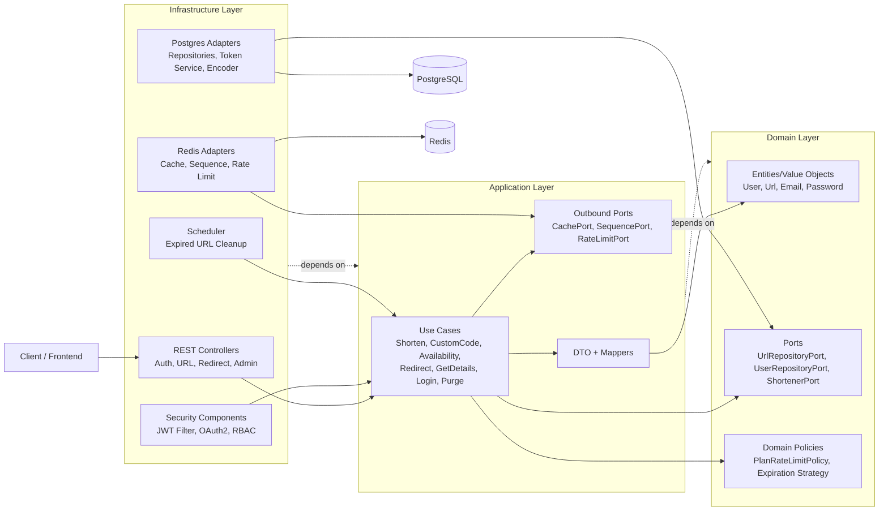
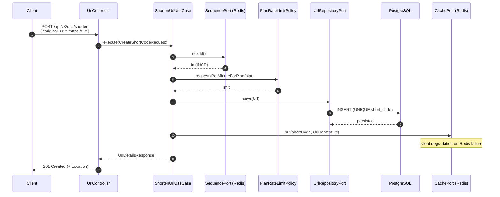

# BlinkLink 🔗

**BlinkLink** is a production-ready URL Shortener REST API built with **Java 21**, **Spring Boot 4**, **PostgreSQL**, and **Redis**, designed with **Clean Architecture**, **Hexagonal Architecture (Ports & Adapters)**, and pure **DDD**.

[](https://openjdk.org/)
[](https://spring.io/projects/spring-boot)
[](https://www.postgresql.org/)
[](https://redis.io/)
[](https://www.docker.com/)
[](https://github.com/features/actions)
[](https://flywaydb.org/)
[](https://junit.org/junit5/)
[](https://www.jacoco.org/jacoco/)
[](https://github.com/PabloTzeliks/blink-link)

---

## Executive Summary — v4.1: The Production Hot Path

BlinkLink started as an MVP, became a secure IAM-backed platform in **v3.0.0**, and in **v4.1** becomes a system built on the patterns production URL shorteners rely on under load. The redirect is the product's hot path — reads outnumber writes by roughly **1000:1** — so v4.1 is organised entirely around serving it fast and keeping it available.

What **v4.1** introduces:

- **Cache-aside redirects** — Redis is checked before PostgreSQL on every redirect, with PostgreSQL remaining the source of truth.
- **Distributed ID generation** — a Redis sequence replaces the PostgreSQL sequence, removing a write-time serialization point.
- **Custom short codes** — VIP/ENTERPRISE users can mint their own codes, with a pre-submission availability check.
- **Per-owner rate limiting** — a Redis sliding-window counter protects the redirect path with plan-tiered limits.
- **Graceful degradation everywhere** — a Redis failure never takes the redirect down; it degrades to PostgreSQL, and the rate limiter fails open.

Everything from **v3.0.0** remains: the full IAM layer, stateless JWT over HttpOnly cookies, OAuth2 (Google/GitHub), RBAC, and plan-based URL lifecycle. The Domain stays pure and framework-agnostic throughout.

---

## Redis — One Datastore, Several Roles

A defining decision of v4.1 is leveraging a **single** Redis deployment for multiple responsibilities instead of adding a new technology per need. Redis is the **speed layer; it is never the source of truth** — it can be lost and rebuilt from PostgreSQL.

| Role | Key | Mechanism | Purpose |
|---|---|---|---|
| **Cache-aside** | `url:{shortCode}` | JSON `UrlContext` (destination + ownerId + plan limit) | One read resolves both the redirect and the rate-limit data |
| **Distributed sequence** | `sequence:url:id` | `INCR` (init from PostgreSQL `MAX(id)`) | Contention-free ID generation |
| **Rate limiting** | `rate:{ownerId}:{windowId}` | Sliding-window counter via atomic Lua script | Plan-tiered abuse protection on the hot path |
| **Event delivery** *(v4.2)* | `blinklink:events:clicks` | Redis Streams + consumer groups | Asynchronous click analytics |

---

## Architecture & Design

### 1) Structural View — Clean + Hexagonal Architecture


```mermaid
flowchart LR
    Client[Client / Frontend]

    subgraph Infrastructure[Infrastructure Layer]
        Controllers[REST Controllers<br/>Auth, URL, Redirect, Admin]
        Security[Security Components<br/>JWT Filter, OAuth2, RBAC]
        PgAdapters[Postgres Adapters<br/>Repositories, Token Service, Encoder]
        RedisAdapters[Redis Adapters<br/>Cache, Sequence, Rate Limit]
        Scheduler[Scheduler<br/>Expired URL Cleanup]
    end

    subgraph Application[Application Layer]
        UseCases[Use Cases<br/>Shorten, CustomCode, Availability,<br/>Redirect, GetDetails, Login, Purge]
        OutPorts[Outbound Ports<br/>CachePort, SequencePort, RateLimitPort]
        DtoMappers[DTO + Mappers]
    end

    subgraph Domain[Domain Layer]
        DomainModel[Entities/Value Objects<br/>User, Url, Email, Password]
        DomainPorts[Ports<br/>UrlRepositoryPort, UserRepositoryPort, ShortenerPort]
        Policies[Domain Policies<br/>PlanRateLimitPolicy, Expiration Strategy]
    end

    DB[(PostgreSQL)]
    Cache[(Redis)]

    Client --> Controllers
    Controllers --> UseCases
    Security --> UseCases
    UseCases --> OutPorts
    UseCases --> DomainPorts
    UseCases --> Policies
    UseCases --> DtoMappers
    DtoMappers --> DomainModel
    PgAdapters --> DomainPorts
    PgAdapters --> DB
    RedisAdapters --> OutPorts
    RedisAdapters --> Cache
    Scheduler --> UseCases

    Infrastructure -.depends on.-> Application
    Application -.depends on.-> Domain
```

### 2) Sequence View — URL Creation (Redis sequence + cache populate)


```mermaid
sequenceDiagram
    autonumber
    participant C as Client
    participant Ctrl as UrlController
    participant UC as ShortenUrlUseCase
    participant Seq as SequencePort (Redis)
    participant Pol as PlanRateLimitPolicy
    participant RepoP as UrlRepositoryPort
    participant DB as PostgreSQL
    participant Cache as CachePort (Redis)

    C->>Ctrl: POST /api/v3/urls/shorten<br/>{ "original_url": "https://..." }
    Ctrl->>UC: execute(CreateShortCodeRequest)
    UC->>Seq: nextId()
    Seq-->>UC: id (INCR)
    UC->>Pol: requestsPerMinuteForPlan(plan)
    Pol-->>UC: limit
    UC->>RepoP: save(Url)
    RepoP->>DB: INSERT (UNIQUE short_code)
    DB-->>RepoP: persisted
    UC->>Cache: put(shortCode, UrlContext, ttl)
    Note over Cache: silent degradation on Redis failure
    UC-->>Ctrl: UrlDetailsResponse
    Ctrl-->>C: 201 Created (+ Location)
```

### 3) Sequence View — Redirect (cache-aside + rate limiting)

```mermaid
sequenceDiagram
    autonumber
    participant C as Client
    participant RCtrl as RedirectUrlController
    participant RUC as RedirectUrlUseCase
    participant Cache as CachePort (Redis)
    participant RepoP as UrlRepositoryPort
    participant RL as RateLimitPort (Redis)

    C->>RCtrl: GET /{shortCode}
    RCtrl->>RUC: execute(ResolveShortCodeRequest)
    RUC->>Cache: getUrlContext(shortCode)

    alt Cache hit
        Cache-->>RUC: UrlContext
    else Cache miss (or Redis down → silent fallback)
        RUC->>RepoP: findByShortCode + owner lookup
        RepoP-->>RUC: Url (or 404 / 410 if expired)
        RUC->>Cache: put(shortCode, UrlContext, ttl)
    end

    RUC->>RL: check(ownerId, limit)
    Note over RL: sliding-window counter (Lua); fails open if Redis down

    alt Within limit
        RUC-->>RCtrl: UrlResponse
        RCtrl-->>C: 302 Found + Location
    else Limit exceeded
        RUC-->>RCtrl: throws RateLimitExceededException
        RCtrl-->>C: 429 + Retry-After + X-RateLimit-*
    end
```

> The database and Redis are accessed only through adapters/ports; the **Domain never depends on JPA, SQL, or Redis**.

---

## Architectural Decision Records (ADRs)

Decisions are documented as ADRs under [`docs/`](docs/). v4 revised the phased plan and **dropped Kafka and DynamoDB** in favour of Redis Streams and ClickHouse.

| ADR | Decision |
|---|---|
| [ADR-01](docs/ADR-01.md) | Retain the layered monolith for v4.1; **adopt Spring Modulith from v4.2** |
| [ADR-02](docs/ADR-02.md) | Revised phased rollout (v4.1 → v4.4); Kafka & DynamoDB dropped |
| [ADR-03](docs/ADR-03.md) | **Redis `INCR`** as the distributed sequence server (replaces PostgreSQL `nextval()`) |
| [ADR-04](docs/ADR-04.md) | Custom-code uniqueness — **PostgreSQL `UNIQUE` as final arbiter** (`SETNX` rejected) |
| [ADR-05](docs/ADR-05.md) | **ClickHouse** for analytics storage (replaces DynamoDB) — *v4.2* |
| [ADR-06](docs/ADR-06.md) | **Redis Streams** for click event delivery (replaces Kafka) — *v4.2* |
| [ADR-07](docs/ADR-07.md) | JPA impedance mismatch & optimistic locking (`@Version` on `UserEntity`) |
| [ADR-08](docs/ADR-08.md) | URL lifecycle & async purge engine (`FOR UPDATE SKIP LOCKED`) |

### Decision highlights

- **`SETNX` rejected for custom-code uniqueness (ADR-04).** `SETNX` returns `false` for two distinct conditions — "code taken" and "Redis down" — and leaves phantom keys if the INSERT later fails. The PostgreSQL `UNIQUE` constraint is unambiguous: a violation means duplicate, full stop. The use case handles exactly one failure mode (`409 Conflict`), and uniqueness never depends on cache availability.
- **Sliding-window counter over a sliding log.** Exact rate limiting (a sorted set of timestamps) costs one entry per request. v4.1 keeps **two counters per owner** (current + previous window, weighted by elapsed time), computed atomically in a Lua script: constant memory, ~0.003% error, evaluated in a single round trip.
- **Business policy in the Domain.** Plan limits live in `PlanRateLimitPolicy`; the `Plan` enum stays a pure identity. The limit is charged to the URL **owner**, derived from their plan.

---

## v4.1 — Feature Evolution

| Area | v3.0.0 | v4.1 |
|---|---|---|
| Redirect path | Direct PostgreSQL lookup | **Cache-aside** via Redis, PostgreSQL as source of truth |
| ID generation | PostgreSQL sequence | **Redis `INCR`** distributed sequence (ADR-03) |
| Short codes | Generated only | **Custom codes** for VIP/ENTERPRISE + availability check (ADR-04) |
| Abuse protection | — | **Per-owner rate limiting**, plan-tiered, on the hot path |
| Failure posture | — | **Graceful degradation** (cache miss → DB) + **fail-open** limiter |
| Ownership | — | Every `Url` carries its creator's `userId` (FK + index) |
| Testing & Quality Gate | 89 tests | **150+ tests** · JaCoCo 80% instruction floor |

---

## Rate Limiting

| Plan | Limit |
|---|---|
| FREE | 100 req/min |
| VIP | 500 req/min |
| ENTERPRISE | 2000 req/min |

On breach, the redirect returns **`429 Too Many Requests`** with `Retry-After` and the standard `X-RateLimit-Limit` / `X-RateLimit-Remaining` / `X-RateLimit-Reset` headers. The check runs on both cache hit and miss; the success path stays lean (no extra headers).

---

## Key Features

- **Cache-aside redirects** with TTL bounded by the URL's own expiry, eviction on purge, and silent fallback to PostgreSQL.
- **Distributed ID generation** via Redis, with PostgreSQL `UNIQUE` as the final collision arbiter and bounded retries.
- **Custom short codes** for paid plans, with format/reserved-word/blocklist validation and a pre-submission availability endpoint.
- **Per-owner rate limiting** (sliding-window counter) with RFC-compliant `429` responses.
- **RBAC** with `USER`/`ADMIN`, stateless **JWT** in HttpOnly cookie, and **OAuth2** (Google/GitHub).
- Plan-aware URL lifecycle (**FREE / VIP / ENTERPRISE** TTL) with an async purge engine using PostgreSQL row-level locking.
- **RFC 7807 Problem Details** for consistent API errors.
- Test strategy across **Unit**, **Integration** (Testcontainers + PostgreSQL + Redis), and **E2E**, plus CI/CD with Maven verification, JaCoCo gating, and Docker build/compose validation.

---

## Quality Gates: Tests & Coverage

- **150+ automated tests** across Unit, Integration, and E2E layers (pure-Mockito units plus Testcontainers for PostgreSQL and Redis — including the sliding-window border case and Redis-down fail-open).
- **JaCoCo minimum coverage gate: 80% instruction coverage** (build fails if not met).
- Test execution runs in CI via `mvn verify -B`, with JUnit reporting and JaCoCo artifacts published in GitHub Actions.

---

## Tech Stack

| Layer | Technology |
|---|---|
| Language | Java 21 |
| Framework | Spring Boot 4.0.1 |
| Data | Spring Data JPA + PostgreSQL 17 |
| Cache / Sequence / Rate limit | Redis (Spring Data Redis) + Lua scripting |
| Migrations | Flyway |
| Security | Spring Security, OAuth2 Client, JWT (`java-jwt`), BCrypt |
| API Docs | SpringDoc OpenAPI (Swagger UI) |
| Testing | JUnit 5, Spring Test, Mockito, Testcontainers |
| Build | Maven |
| Containers | Docker, Docker Compose |
| CI/CD | GitHub Actions |

---

## API Reference (Shortened)

### Create a short URL

```bash
curl -i -X POST 'http://localhost:8080/api/v3/urls/shorten' \
  -H 'Content-Type: application/json' \
  -H 'Cookie: jwt_token=<your_token>' \
  -d '{ "original_url": "https://example.com/very/long/path" }'
```

### Create a custom short code (VIP / ENTERPRISE)

```bash
curl -i -X POST 'http://localhost:8080/api/v3/urls/shorten' \
  -H 'Content-Type: application/json' \
  -H 'Cookie: jwt_token=<your_token>' \
  -d '{ "original_url": "https://example.com", "custom_code": "launch2026" }'
```

`409 Conflict` if the code is already taken · `422` if the format is invalid · `403` if the plan is not eligible.

### Check code availability

```http
GET /api/v3/urls/codes/{code}/availability
```

Always `200 OK`:

```json
{ "code": "launch2026", "available": true }
```

### Redirect

```http
GET /launch2026
```

- Active → `302 Found` + `Location: <original_url>`
- Expired → `410 Gone` (RFC 7807)
- Not found → `404 Not Found` (RFC 7807)
- Rate limited → `429 Too Many Requests` + `Retry-After` + `X-RateLimit-*`

---

## Local Setup & CI/CD

### Run with the production compose file

1. Provide environment variables (`.env` or exported):
   `POSTGRES_DB`, `POSTGRES_USER`, `POSTGRES_PASSWORD`, `REDIS_HOST`, `REDIS_PORT`, `APP_SECRET_KEY`, `APP_SECRET_TOKEN`, `APP_BASE_URL`, `FRONT_BASE_URL`, `GOOGLE_CLIENT_ID`, `GOOGLE_CLIENT_SECRET`, `GITHUB_CLIENT_ID`, `GITHUB_CLIENT_SECRET`.
2. Start services:

```bash
docker compose -f docker-compose.prod.yml up --build
```

3. The API is available at `http://localhost:8080`.

### Build & test locally

```bash
mvn verify -B
```

> Requires **Java 21** and a reachable **Docker** daemon (Testcontainers spins up PostgreSQL and Redis).

### Containerization and delivery

- **Multi-stage Dockerfile** builds with a Maven image and runs on a lightweight JRE image as a non-root user.
- **GitHub Actions** runs `mvn verify -B`, uploads the JaCoCo report, publishes JUnit reports, builds the Docker image, and validates `docker-compose.prod.yml`.

---

## Roadmap

The v4 plan was revised in 2026 — **Kafka and DynamoDB were dropped** (see ADR-02, ADR-05, ADR-06).

- **v4.1 — Redis hot path *(delivered)*** — cache-aside, distributed sequence, custom codes, rate limiting.
- **v4.2 — Modular & event-driven** — Spring Modulith module boundaries, **Redis Streams** click pipeline, **ClickHouse** analytics storage.
- **v4.3 — Analytics API** — plan-gated click/timeseries endpoints.
- **v4.4 — AWS** — full deploy with managed PostgreSQL, ElastiCache, managed ClickHouse, metrics and tracing.

---

BlinkLink v4.1 demonstrates how to evolve an MVP into a production-grade platform: a fast, resilient redirect hot path; deliberate, documented architectural trade-offs; a single datastore leveraged for several roles; and clean boundaries kept intact throughout — all as a personal lab for engineering complex systems on a realistic project.
