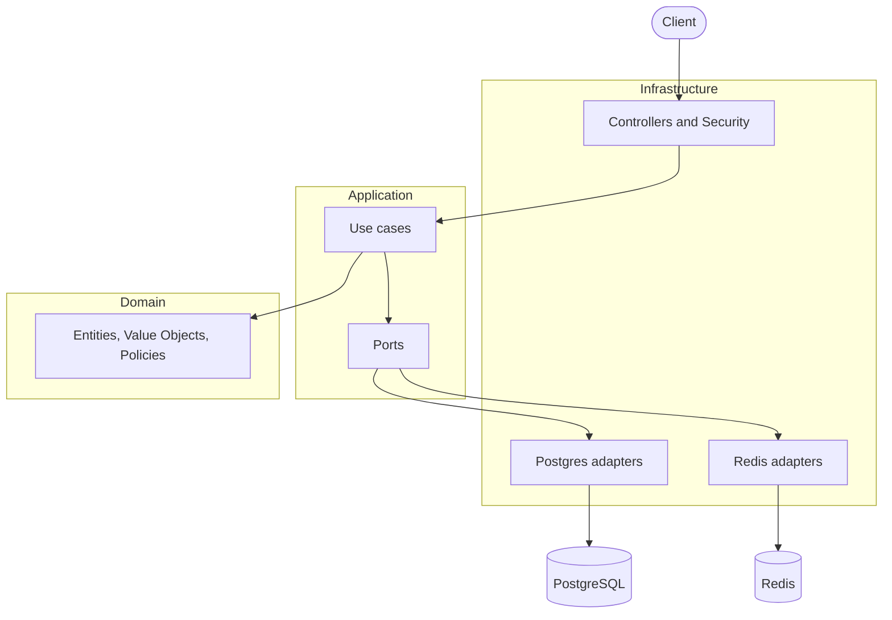
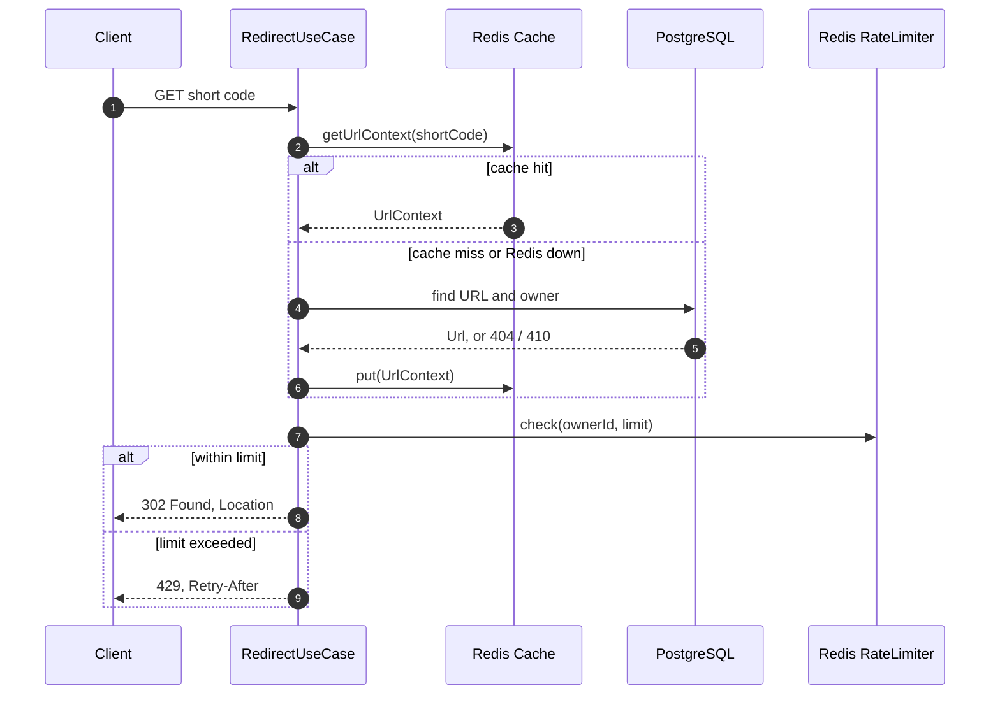

# BlinkLink

URL shortener REST API built with Java 21, Spring Boot 4, PostgreSQL and Redis. Layered monolith with Clean and Hexagonal architecture and a framework-agnostic domain.

[](https://openjdk.org/)
[](https://spring.io/projects/spring-boot)
[](https://www.postgresql.org/)
[](https://redis.io/)
[](https://www.jacoco.org/jacoco/)
[](https://github.com/PabloTzeliks/blink-link)

## Overview

Short-link redirects are served from a Redis cache in front of PostgreSQL. IDs come from a Redis sequence, custom codes are available to paid plans, and the redirect path is rate limited per plan. Redis is the speed layer and PostgreSQL is the source of truth, so a Redis outage degrades the system instead of breaking it. The IAM layer from v3 (JWT over HttpOnly cookies, OAuth2 with Google and GitHub, RBAC) remains in place.

Current version: v4.1. Around 150 tests (unit, Testcontainers integration, E2E) behind an 80% JaCoCo instruction gate.

## Architecture

The domain has no Spring, JPA or Redis imports. Use cases call ports; adapters implement them against PostgreSQL and Redis.


```mermaid
flowchart TB
    client(["Client"])

    subgraph infra["Infrastructure"]
        web["Controllers and Security"]
        pgadp["Postgres adapters"]
        rdadp["Redis adapters"]
    end

    subgraph app["Application"]
        uc["Use cases"]
        ports["Ports"]
    end

    subgraph dom["Domain"]
        model["Entities, Value Objects, Policies"]
    end

    pg[("PostgreSQL")]
    rd[("Redis")]

    client --> web
    web --> uc
    uc --> ports
    uc --> model
    ports --> pgadp
    ports --> rdadp
    pgadp --> pg
    rdadp --> rd
```

### Redirect path

A cache-aside lookup followed by a rate-limit check, applied on both hit and miss.


```mermaid
sequenceDiagram
    autonumber
    participant C as Client
    participant UC as RedirectUseCase
    participant Cache as Redis Cache
    participant DB as PostgreSQL
    participant RL as Redis RateLimiter

    C->>UC: GET short code
    UC->>Cache: getUrlContext(shortCode)
    alt cache hit
        Cache-->>UC: UrlContext
    else cache miss or Redis down
        UC->>DB: find URL and owner
        DB-->>UC: Url, or 404 / 410
        UC->>Cache: put(UrlContext)
    end
    UC->>RL: check(ownerId, limit)
    alt within limit
        UC-->>C: 302 Found, Location
    else limit exceeded
        UC-->>C: 429, Retry-After
    end
```

## Redis roles

One Redis instance covers several responsibilities. It is never the source of truth and can be rebuilt from PostgreSQL.

| Role | Key | Mechanism |
|---|---|---|
| Cache-aside | `url:{shortCode}` | JSON `UrlContext` (destination, ownerId, rateLimit) |
| Distributed sequence | `sequence:url:id` | `INCR`, initialised from PostgreSQL `MAX(id)` |
| Rate limiting | `rate:{ownerId}:{windowId}` | Two String counters, sliding window via Lua |
| Event delivery (v4.2) | `blinklink:events:clicks` | Redis Streams with consumer groups |

## Rate limiting

Per-plan limits, enforced on the redirect path with a sliding-window counter keyed on the URL owner.

| Plan | Limit |
|---|---|
| FREE | 100 req/min |
| VIP | 500 req/min |
| ENTERPRISE | 2000 req/min |

On breach, the redirect returns `429` with `Retry-After` and `X-RateLimit-Limit` / `X-RateLimit-Remaining` / `X-RateLimit-Reset`. The check runs on hit and miss; the success path adds no headers. If Redis is unavailable, the check allows the request.

## Key decisions

Documented as ADRs in [`docs/`](docs/). The v4 plan dropped Kafka and DynamoDB in favour of Redis Streams and ClickHouse.

| ADR | Decision |
|---|---|
| [ADR-03](docs/ADR-03.md) | Redis `INCR` as the distributed sequence, replacing PostgreSQL `nextval()` |
| [ADR-04](docs/ADR-04.md) | Custom-code uniqueness arbitrated by PostgreSQL `UNIQUE` (`SETNX` rejected) |
| [ADR-05](docs/ADR-05.md) | ClickHouse for analytics storage (v4.2) |
| [ADR-06](docs/ADR-06.md) | Redis Streams for click event delivery (v4.2) |
| [ADR-07](docs/ADR-07.md) | JPA optimistic locking with `@Version` on `UserEntity` |
| [ADR-08](docs/ADR-08.md) | URL lifecycle and async purge with `FOR UPDATE SKIP LOCKED` |

Two that shaped v4.1:

- Custom-code uniqueness is arbitrated by the PostgreSQL `UNIQUE` constraint, not Redis `SETNX`. `SETNX` cannot tell "code taken" from "Redis down" and can leave phantom keys on a failed insert. A constraint violation is unambiguous and maps to `409 Conflict`.
- Rate limiting uses a sliding-window counter (two counters per owner) rather than a sorted set of timestamps. It trades a negligible approximation error for constant memory and a single round trip.

## Tech stack

| Area | Technology |
|---|---|
| Language / framework | Java 21, Spring Boot 4.0.1 |
| Data | Spring Data JPA, PostgreSQL 17, Flyway |
| Redis | Spring Data Redis, Lua scripting |
| Security | Spring Security, OAuth2 Client, JWT, BCrypt |
| Testing | JUnit 5, Mockito, Testcontainers |
| Build / CI | Maven, Docker, GitHub Actions |

## API

All endpoints under `/api/v3/urls` require authentication. The redirect (`GET /{shortCode}`) is public.

| Endpoint | Description |
|---|---|
| `POST /api/v3/urls/shorten` | Create a short URL. A `custom_code` field routes to the custom flow (VIP/ENTERPRISE). |
| `GET /api/v3/urls/codes/{code}/availability` | Returns `{ "code": "...", "available": boolean }`, always `200`. |
| `GET /{shortCode}` | Redirect. `302`, `410` if expired, `404` if unknown, `429` if rate limited. |

```bash
curl -i -X POST 'http://localhost:8080/api/v3/urls/shorten' \
  -H 'Content-Type: application/json' \
  -H 'Cookie: jwt_token=<token>' \
  -d '{ "original_url": "https://example.com", "custom_code": "launch2026" }'
```

## Running locally

```bash
docker compose -f docker-compose.prod.yml up --build
```

Requires the usual database, Redis and OAuth environment variables (`POSTGRES_*`, `REDIS_HOST`, `REDIS_PORT`, `APP_SECRET_*`, `GOOGLE_*`, `GITHUB_*`).

Build and test with `mvn verify -B` (needs Java 21 and a running Docker daemon for Testcontainers).

## Roadmap

- v4.1, delivered: cache-aside, distributed sequence, custom codes, rate limiting.
- v4.2: Spring Modulith boundaries, Redis Streams click pipeline, ClickHouse analytics.
- v4.3: analytics read API.
- v4.4: AWS deployment and observability.
